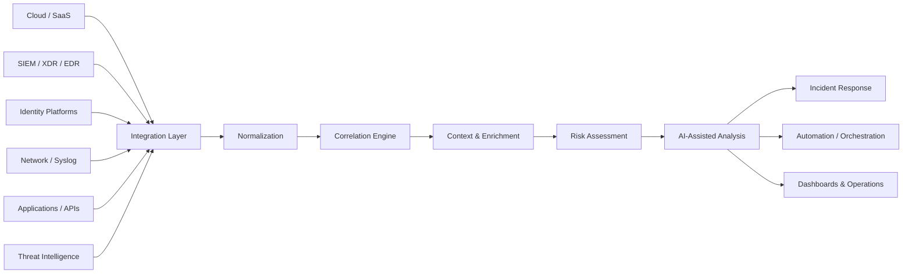

# SOC CORE

> **SOC CORE adapts to the company's security ecosystem, not the other way around.**

**SOC CORE** is a security operations engineering project focused on bringing together **security telemetry, event correlation, threat intelligence enrichment, automation, AI-assisted analysis and incident response** through an adaptable integration architecture.

This repository is the **public technical documentation and engineering portfolio** for SOC CORE. It intentionally does **not** contain production source code, credentials, operational secrets, customer data, internal network details or sensitive configurations.

[Português (Brasil)](README.pt-BR.md)

---

## Why SOC CORE

Security environments are rarely built around a single vendor.

Organizations operate across combinations of:

- cloud and SaaS platforms;
- on-premises infrastructure;
- hybrid and multi-cloud environments;
- SIEM, XDR and EDR platforms;
- identity providers;
- firewalls, network devices and security appliances;
- vulnerability management platforms;
- threat intelligence sources;
- business and incident-management systems.

**SOC CORE** is designed around an integration-first model that can adapt to heterogeneous environments.

### Infrastructure-Agnostic Architecture

SOC CORE follows a **cloud, vendor and technology-agnostic design philosophy**.

Integrations may be implemented through mechanisms such as:

- REST APIs
- Webhooks
- Syslog
- Agents
- Log forwarding
- Databases
- Message queues
- File-based telemetry
- Other supported data interfaces

Whenever a technology provides an accessible mechanism for retrieving, collecting or forwarding security telemetry, SOC CORE can be extended with a dedicated integration layer to **ingest, normalize, correlate, enrich and process** that information.

> Integration feasibility always depends on what the source technology exposes, including API capabilities, authentication, permissions, licensing, data quality, connectivity, rate limits and other technical restrictions.

### Vulnerability Management

SOC CORE is designed to **adapt to the organization's existing vulnerability management ecosystem**. When a company already operates a vulnerability management or scanning platform, SOC CORE can consume the available findings and context through supported integration mechanisms and incorporate them into correlation, prioritization and security operations workflows.

When no dedicated vulnerability scanning solution is available, **SOC CORE also provides an integrated vulnerability scanning capability**, allowing the platform to identify technical exposures and feed vulnerability findings into the same operational context used for analysis, prioritization and response.

This means vulnerability management can operate as either an **integrated external capability or a native SOC CORE capability**, depending on the organization's infrastructure and existing security stack.

### Asset Inventory Management

**SOC CORE includes an integrated Asset Inventory Management capability** designed to consolidate security-relevant asset visibility from multiple authorized data sources into a unified operational view.

The inventory can combine information from endpoint/security platforms and network discovery capabilities, correlating observations to reduce duplicate records and preserve the source of each piece of evidence.

Available capabilities include:

- multi-source asset discovery and inventory consolidation;
- correlation of device identities across supported integrations;
- classification of endpoints, servers, network infrastructure, security appliances, printers, cameras, voice devices and other observed asset types;
- operational inventory views based on recent asset activity;
- visibility into hostname, IP address, MAC address, operating system, manufacturer and exposed services when available from the source;
- source provenance showing whether an asset was observed by one or multiple integrations;
- search and filtering by asset type and source;
- per-asset detail views with recent observations and identifiers;
- CSV export for operational reporting and audit support;
- identification of unknown or insufficiently classified assets for analyst review.

The asset inventory follows SOC CORE's integration-first architecture. Existing technologies can remain the authoritative source for their own data while SOC CORE acts as a **correlation, normalization and operational visibility layer** across them.

> Public documentation describes only the functional capability and conceptual behavior of Asset Inventory Management. Production asset lists, internal addresses, hostnames, device identifiers, correlation rules and operational configurations are not published.

### Cloud Security / CASB

**SOC CORE includes an integrated CASB (Cloud Access Security Broker) capability** focused on discovering, providing visibility into and governing the use of cloud applications and services across corporate environments.

The Cloud Security capability can consume telemetry from security integrations already available in the environment to identify applications used by users and devices, normalize that information and incorporate it into SOC CORE's operational security context.

Available capabilities include:

- **Cloud Discovery** to identify cloud applications and services observed in the environment;
- **Shadow IT** visibility for applications that are not yet reviewed, authorized or governed by the organization;
- application classification and categorization based on observed usage context;
- visibility into users, assets and event volume associated with discovered applications;
- risk assessment and prioritization for applications requiring review;
- governance workflows for **unreviewed, sanctioned, unsanctioned, blocked or organization-approved applications**;
- maintenance of a corporate approved-application list based on the organization's own decisions;
- separation between CASB-relevant applications and purely technical network, infrastructure or protocol telemetry;
- time-based audit views to support recurring reviews of cloud application usage.

The CASB capability follows the same SOC CORE integration principle: **governance decisions remain under human and organizational control**. The platform identifies, classifies, contextualizes and presents applications for review without replacing the company's formal approval process.

> Public documentation describes only the functional capability and conceptual architecture of CASB. Internal rules, production integrations, corporate application lists, users, addressing, credentials and operational configurations are not published.


### Network Exposure & Port Scanning

SOC CORE also supports **network exposure assessment through Nmap-based port scanning** as part of its security visibility capabilities.

This capability can be used to identify:

- open TCP/UDP ports on authorized assets;
- network services exposed by hosts;
- potential unnecessary or unexpected service exposure;
- information that can support asset validation and vulnerability analysis;
- network exposure context for security investigation and remediation workflows.

Port scanning results can complement vulnerability management by helping analysts understand **which services are reachable and potentially exposed**, providing additional context for prioritization and remediation.

> Port scanning is intended exclusively for assets and environments where the organization has authorization to perform security assessments. SOC CORE's public documentation does not expose production targets, internal addresses, scanning commands or operational configurations.

### Network Detection & Prevention (IDS/IPS)

**SOC CORE includes a modular Network Detection and Prevention capability (IDS/IPS)** designed to analyze authorized network telemetry and incorporate network detections into the same operational context used by the rest of the platform.

Available capabilities include:

- network traffic monitoring and analysis from supported sensors and integrations;
- detection of suspicious or malicious patterns using rules, signatures and contextual logic;
- normalization of network alerts for correlation with asset, identity, vulnerability and threat intelligence context;
- **IDS mode** for passive detection, visibility and alerting;
- **IPS mode** for preventive controls when the network architecture, integration method and organizational policy allow safe enforcement;
- prioritization of network detections using asset criticality, exposure and other security context available to SOC CORE;
- integration of network detections with incident investigation, automation and analyst workflows;
- auditable, organization-controlled prevention policies with human oversight for consequential actions.

IDS/IPS follows SOC CORE's integration-first approach and can operate as a native or integrated network-defense capability depending on the organization's environment.

> Prevention capabilities depend on sensor placement, network architecture, supported integration mechanisms and the organization's security policy. Public documentation does not expose production rules, signatures, internal topology, addresses, prevention policies or operational configurations.

---

## Conceptual Architecture



The public architecture is intentionally conceptual. Production topology, credentials, internal addressing, customer information and implementation-specific details are not published.

---

### Web Chat / SOC CORE AI

**SOC CORE includes a Web Chat interface designed specifically for cybersecurity operations**, allowing analysts to interact with the platform's capabilities using natural language.

The Web Chat provides a direct operational interface to SOC CORE's backend and authorized security integrations. Its purpose is to make technical security data easier and faster to consume during investigation, triage and remediation workflows.

Supported use cases include:

- querying and understanding security incidents and alerts;
- requesting context about vulnerabilities, CVEs and Indicators of Compromise (IOCs);
- identifying affected assets and relevant evidence available to SOC CORE;
- receiving concise summaries, impact context and recommended investigation or remediation actions;
- correlating information from the security integrations available to the platform;
- retrieving details from incidents provided by integrated XDR platforms, including a reference to the original incident when available;
- assisting analysts during triage, investigation and incident response.

**SOC CORE AI is specialized in cybersecurity operations.** The interface is designed to support SOC and Vulnerability Management activities, with a focus on investigation, technical understanding, prioritization and remediation.

The Web Chat **does not replace integrated security platforms or analyst decision-making**. It acts as an interaction and assistance layer over the security data SOC CORE is authorized to process.

> Public documentation describes only the functional behavior of this capability. Production code, internal URLs, credentials, tokens, environment identifiers, real incident data and sensitive backend implementation details are not published.

---

## Design Principles

**Integration First**  
SOC CORE is designed to connect to the security ecosystem already in place.

**Vendor Agnostic**  
The architecture does not depend on a single cloud provider or security vendor.

**Normalize Before Correlating**  
Telemetry from different sources is transformed into a consistent security context before correlation.

**Context Over Alert Volume**  
Threat intelligence, identity, asset and event context can be used to improve prioritization.

**Automation With Human Oversight**  
Automation should reduce repetitive work without removing accountability from security decisions.

**AI as an Analyst Assistant**  
AI can support summarization, context generation and prioritization while critical security decisions remain subject to human validation.

**Security by Design**  
Least privilege, secret protection, auditability, input validation, segmentation and secure integration patterns are treated as architectural requirements.

---

## Integration Philosophy

SOC CORE does not assume that an organization will replace its existing tools.

Instead, the platform is designed to act as a **security integration and correlation layer** across different technologies.

A source may be integrated when it provides an appropriate telemetry interface, for example:

```text
Security Technology
        |
        |  API / Webhook / Syslog / Agent / Logs / Database
        v
Integration Adapter
        |
        v
Normalization
        |
        v
Correlation + Enrichment
        |
        v
Risk / AI-Assisted Analysis
        |
        +--> Incident Response
        +--> Automation
        +--> Dashboards
```

See [Integration Philosophy](docs/INTEGRATIONS.md) for additional details.

---

## Security & Public Disclosure

This repository follows a strict **sanitization-first publication model**.

Public content may include:

- conceptual architecture;
- generic integration patterns;
- sanitized examples;
- fictitious incidents and telemetry;
- documentation-only schemas;
- engineering principles;
- high-level roadmap information.

Public content will not include:

- production source code;
- credentials, API keys or tokens;
- internal IP addresses or hostnames;
- tenant or subscription identifiers;
- customer or employee data;
- real incident payloads containing identifiable information;
- exact production topology;
- internal security controls that would materially increase attack surface;
- proprietary operational configurations.

Read the full [Public Disclosure & Sanitization Policy](docs/PUBLIC-DISCLOSURE-POLICY.md).

---

## Documentation

| Document | Description |
|---|---|
| [Architecture](docs/ARCHITECTURE.md) | Conceptual SOC CORE architecture and processing flow |
| [Integration Philosophy](docs/INTEGRATIONS.md) | How SOC CORE approaches heterogeneous technologies |
| [Security Model](docs/SECURITY-MODEL.md) | Security principles for the platform itself |
| [AI-Assisted Analysis](docs/AI-ASSISTED-ANALYSIS.md) | Responsible use of AI in security operations |
| [Public Disclosure Policy](docs/PUBLIC-DISCLOSURE-POLICY.md) | What can and cannot be published |
| [Roadmap](ROADMAP.md) | High-level public roadmap |
| [Changelog](CHANGELOG.md) | Changes to the public documentation project |
| [Security Policy](SECURITY.md) | Responsible security reporting guidance |

---

## Sanitized Examples

The `examples/` directory contains **fictional and sanitized material only**.

Reserved documentation IP ranges, invalid example domains and fabricated identities are used to avoid exposing real infrastructure.

- [Example Incident](examples/sanitized-incident.json)
- [Example Detection](examples/sanitized-detection.md)

---

## Areas of Engineering

SOC CORE explores security engineering across:

- Security Operations Center (SOC)
- SIEM / XDR integration
- Detection engineering
- Incident correlation
- Threat intelligence
- IOC enrichment
- Vulnerability management and integrated scanning
- Asset inventory management
- Multi-source asset discovery and correlation
- Cloud Security / CASB
- Cloud Discovery and Shadow IT
- Cloud application governance
- Network exposure and port scanning
- Network Detection & Prevention (IDS/IPS)
- Network traffic analysis and security monitoring
- Identity security
- Security automation
- Incident orchestration
- AI-assisted security analysis
- Security observability
- Platform hardening

---

## Project Status

SOC CORE is under active engineering and documentation development.

The public repository is intentionally **documentation-first**. Implementation details may be represented through sanitized examples and conceptual interfaces without exposing production code or operational data.

---

## Author

**Danilo Sincerre Vida**  
Cybersecurity | Security Engineering | Security Operations | Vulnerability Management

GitHub: [@danilovida](https://github.com/danilovida)

---

## Disclaimer

SOC CORE is an engineering project and technical portfolio. References to third-party technologies describe potential integration patterns and do not imply endorsement, certification or affiliation with their respective vendors.

All public examples are intended for educational and architectural demonstration purposes.
