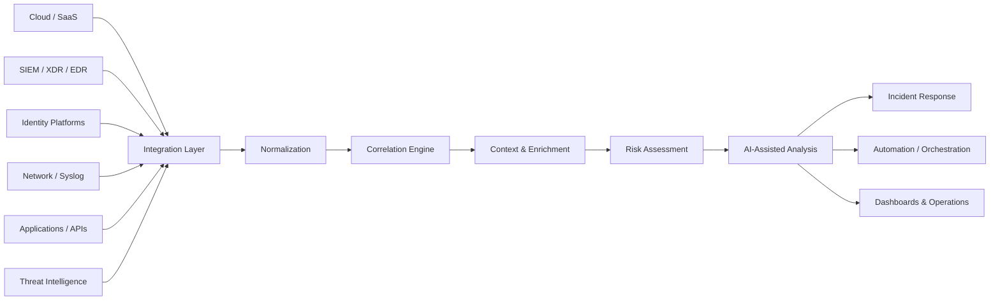

# SOC CORE

> **SOC CORE adapts to the company's security ecosystem, not the other way around.**

**SOC CORE** is a security operations engineering project focused on bringing together **security telemetry, event correlation, threat intelligence enrichment, automation, AI-assisted analysis and incident response** through an adaptable integration architecture.

This repository is the **public technical documentation and engineering portfolio** for SOC CORE. It intentionally does **not** contain production source code, credentials, operational secrets, customer data, internal network details or sensitive configurations.

[Português (Brasil)](README.pt-BR.md)

---

## Why SOC CORE

Security environments are rarely built around a single vendor.

Organizations operate across combinations of:

- cloud and SaaS platforms;
- on-premises infrastructure;
- hybrid and multi-cloud environments;
- SIEM, XDR and EDR platforms;
- identity providers;
- firewalls, network devices and security appliances;
- vulnerability management platforms;
- threat intelligence sources;
- business and incident-management systems.

**SOC CORE** is designed around an integration-first model that can adapt to heterogeneous environments.

### Infrastructure-Agnostic Architecture

SOC CORE follows a **cloud, vendor and technology-agnostic design philosophy**.

Integrations may be implemented through mechanisms such as:

- REST APIs
- Webhooks
- Syslog
- Agents
- Log forwarding
- Databases
- Message queues
- File-based telemetry
- Other supported data interfaces

Whenever a technology provides an accessible mechanism for retrieving, collecting or forwarding security telemetry, SOC CORE can be extended with a dedicated integration layer to **ingest, normalize, correlate, enrich and process** that information.

> Integration feasibility always depends on what the source technology exposes, including API capabilities, authentication, permissions, licensing, data quality, connectivity, rate limits and other technical restrictions.

---

## Conceptual Architecture



The public architecture is intentionally conceptual. Production topology, credentials, internal addressing, customer information and implementation-specific details are not published.

---

## Design Principles

**Integration First**  
SOC CORE is designed to connect to the security ecosystem already in place.

**Vendor Agnostic**  
The architecture does not depend on a single cloud provider or security vendor.

**Normalize Before Correlating**  
Telemetry from different sources is transformed into a consistent security context before correlation.

**Context Over Alert Volume**  
Threat intelligence, identity, asset and event context can be used to improve prioritization.

**Automation With Human Oversight**  
Automation should reduce repetitive work without removing accountability from security decisions.

**AI as an Analyst Assistant**  
AI can support summarization, context generation and prioritization while critical security decisions remain subject to human validation.

**Security by Design**  
Least privilege, secret protection, auditability, input validation, segmentation and secure integration patterns are treated as architectural requirements.

---

## Integration Philosophy

SOC CORE does not assume that an organization will replace its existing tools.

Instead, the platform is designed to act as a **security integration and correlation layer** across different technologies.

A source may be integrated when it provides an appropriate telemetry interface, for example:

```text
Security Technology
        |
        |  API / Webhook / Syslog / Agent / Logs / Database
        v
Integration Adapter
        |
        v
Normalization
        |
        v
Correlation + Enrichment
        |
        v
Risk / AI-Assisted Analysis
        |
        +--> Incident Response
        +--> Automation
        +--> Dashboards
```

See [Integration Philosophy](docs/INTEGRATIONS.md) for additional details.

---

## Security & Public Disclosure

This repository follows a strict **sanitization-first publication model**.

Public content may include:

- conceptual architecture;
- generic integration patterns;
- sanitized examples;
- fictitious incidents and telemetry;
- documentation-only schemas;
- engineering principles;
- high-level roadmap information.

Public content will not include:

- production source code;
- credentials, API keys or tokens;
- internal IP addresses or hostnames;
- tenant or subscription identifiers;
- customer or employee data;
- real incident payloads containing identifiable information;
- exact production topology;
- internal security controls that would materially increase attack surface;
- proprietary operational configurations.

Read the full [Public Disclosure & Sanitization Policy](docs/PUBLIC-DISCLOSURE-POLICY.md).

---

## Documentation

| Document | Description |
|---|---|
| [Architecture](docs/ARCHITECTURE.md) | Conceptual SOC CORE architecture and processing flow |
| [Integration Philosophy](docs/INTEGRATIONS.md) | How SOC CORE approaches heterogeneous technologies |
| [Security Model](docs/SECURITY-MODEL.md) | Security principles for the platform itself |
| [AI-Assisted Analysis](docs/AI-ASSISTED-ANALYSIS.md) | Responsible use of AI in security operations |
| [Public Disclosure Policy](docs/PUBLIC-DISCLOSURE-POLICY.md) | What can and cannot be published |
| [Roadmap](ROADMAP.md) | High-level public roadmap |
| [Changelog](CHANGELOG.md) | Changes to the public documentation project |
| [Security Policy](SECURITY.md) | Responsible security reporting guidance |

---

## Sanitized Examples

The `examples/` directory contains **fictional and sanitized material only**.

Reserved documentation IP ranges, invalid example domains and fabricated identities are used to avoid exposing real infrastructure.

- [Example Incident](examples/sanitized-incident.json)
- [Example Detection](examples/sanitized-detection.md)

---

## Areas of Engineering

SOC CORE explores security engineering across:

- Security Operations Center (SOC)
- SIEM / XDR integration
- Detection engineering
- Incident correlation
- Threat intelligence
- IOC enrichment
- Vulnerability context
- Identity security
- Security automation
- Incident orchestration
- AI-assisted security analysis
- Security observability
- Platform hardening

---

## Project Status

SOC CORE is under active engineering and documentation development.

The public repository is intentionally **documentation-first**. Implementation details may be represented through sanitized examples and conceptual interfaces without exposing production code or operational data.

---

## Author

**Danilo Sincerre Vida**  
Cybersecurity | Security Engineering | Security Operations | Vulnerability Management

GitHub: [@danilovida](https://github.com/danilovida)

---

## Disclaimer

SOC CORE is an engineering project and technical portfolio. References to third-party technologies describe potential integration patterns and do not imply endorsement, certification or affiliation with their respective vendors.

All public examples are intended for educational and architectural demonstration purposes.
