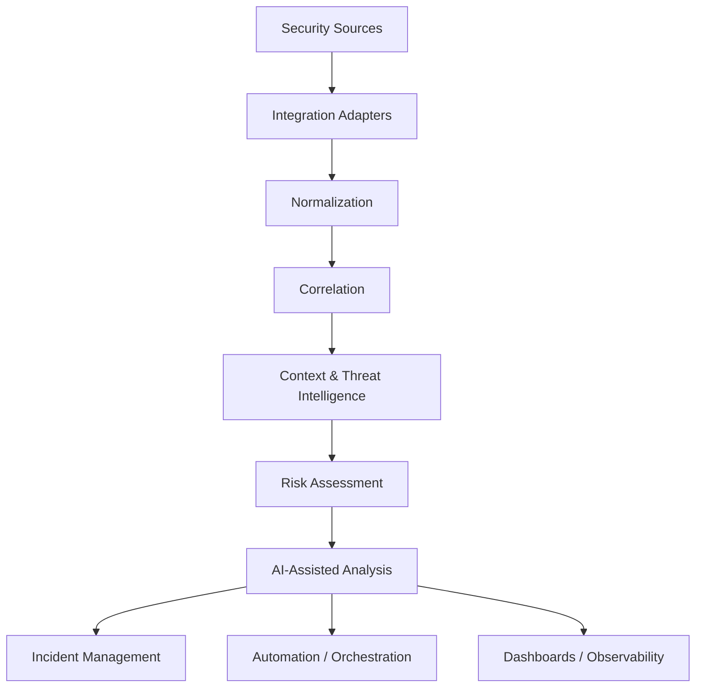

# SOC CORE — Conceptual Architecture

This document describes the **public conceptual architecture** of SOC CORE.

It intentionally omits production implementation details, internal addressing, credentials, tenant information and environment-specific topology.

## Processing Model

## Layers

### 1. Security Sources
Potential sources include identity systems, endpoints, network devices, SIEM/XDR platforms, cloud services, vulnerability platforms and threat intelligence feeds.

### 2. Integration Adapters
Adapters isolate vendor-specific communication from the core processing model. An adapter may use APIs, webhooks, Syslog, log files, agents, databases or other supported interfaces.

### 3. Normalization
Incoming telemetry is mapped into a consistent internal representation so that detections can work across heterogeneous sources.

### 4. Correlation
Related events can be combined using identifiers, entities, timing, source context and other relevant attributes.

### 5. Context & Enrichment
Additional context can include asset information, identity information, threat intelligence, vulnerability context and historical observations.

### 6. Risk Assessment
Signals may be evaluated according to confidence, severity, source quality, exposure, identity context and other defensible factors.

### 7. AI-Assisted Analysis
AI may assist with summarization, contextualization, triage support and analyst-facing explanations. Human oversight remains mandatory for consequential security actions.

### 8. Response & Operations
Processed security context can support incident management, automation, orchestration and dashboards.

## Architectural Goal

The goal is not to replace every security technology in an environment.

The goal is to provide a flexible layer that helps different technologies work together through a common operational model.
